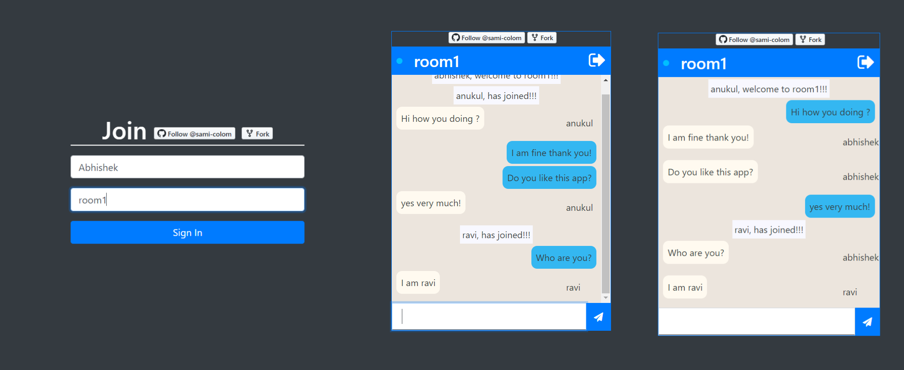

<!--
*** Thanks for checking out the Best-README-Template. If you have a suggestion
*** that would make this better, please fork the repo and create a pull request
*** or simply open an issue with the tag "enhancement".
*** Thanks again! Now go create something AMAZING! :D
***
***
***
*** To avoid retyping too much info. Do a search and replace for the following:
*** sami-colon, react-chat-app, twitter_handle, abhishek.personal.email@gmail.com, Anonymous Rooms, Anonymous Rooms is a real time chat application
where user can create a new room and
any no of users can be joined to same room.
This app provides users to chat with each
other in real time.
-->


<!-- PROJECT SHIELDS -->
<!--
*** I'm using markdown "reference style" links for readability.
*** Reference links are enclosed in brackets [ ] instead of parentheses ( ).
*** See the bottom of this document for the declaration of the reference variables
*** for contributors-url, forks-url, etc. This is an optional, concise syntax you may use.
*** https://www.markdownguide.org/basic-syntax/#reference-style-links

[![Contributors][contributors-shield]][contributors-url]
[![Forks][forks-shield]][forks-url]
[![Stargazers][stars-shield]][stars-url]
[![Issues][issues-shield]][issues-url]
[![MIT License][license-shield]][license-url]
[![LinkedIn][linkedin-shield]][linkedin-url]

-->

<!-- PROJECT LOGO -->
<br />
<p align="center">
  <a href="https://github.com/sami-colon/react-chat-app">
    
  </a>

  <h3 align="center">Anonymous Rooms</h3>

  <p align="center">
    Anonymous Rooms is a real time chat application where user can create a new room and any no of users can be joined to same room. This app provides users to chat with each other in real time.
    <br />
    <a href="https://github.com/sami-colon/react-chat-app"><strong>Explore the docs »</strong></a>
    <br />
    <br />
    <a href="https://real-chat-room.herokuapp.com/">View Demo</a>
    ·
    <a href="https://github.com/sami-colon/react-chat-app/issues">Report Bug</a>
    ·
    <a href="https://github.com/sami-colon/react-chat-app/issues">Request Feature</a>
  </p>
</p>


<!-- TABLE OF CONTENTS -->
<details open="open">
  <summary><h2 style="display: inline-block">Table of Contents</h2></summary>
  <ol>
    <li>
      <a href="#about-the-project">About The Project</a>
      <ul>
        <li><a href="#built-with">Built With</a></li>
      </ul>
    </li>
    <li>
      <a href="#getting-started">Getting Started</a>
      <ul>
        <li><a href="#prerequisites">Prerequisites</a></li>
        <li><a href="#installation">Installation</a></li>
      </ul>
    </li>
    <li><a href="#usage">Usage</a></li>
    <li><a href="#roadmap">Roadmap</a></li>
    <li><a href="#contributing">Contributing</a></li>
    <li><a href="#license">License</a></li>
    <li><a href="#contact">Contact</a></li>
    <li><a href="#acknowledgements">Acknowledgements</a></li>
  </ol>
</details>


<!-- ABOUT THE PROJECT -->
## About The Project
[Anonymous Chat](https://real-chat-room.herokuapp.com/)
<p>
  Anonymous Rooms is a real time chat application where user can create a new room and any no of users can be joined to same room. This app provides users to chat with each
other in real time.
</p>


### Built With

* [ReactJs](https://reactjs.org/)
* [ExpresJs](https://expressjs.com/)
* [Socket.io](https://socket.io/)


<!-- GETTING STARTED -->
## Getting Started

To get a local copy up and running follow these simple steps.

### Prerequisites

This is an example of how to list things you need to use the software and how to install them.
* npm
  ```sh
  npm install npm@latest -g
  ```

### Installation

1. Clone the repo
   ```sh
   git clone https://github.com/sami-colon/react-chat-app.git
   ```
2. Install NPM packages
   ```sh
   npm install
   ```


<!-- USAGE EXAMPLES -->
## Usage

For the project to build, **these files must exist with exact filenames**:

* `public/index.html` is the page template;
* `src/index.js` is the JavaScript entry point.
* `/src/ENDPOINTS.js` is the config file for providing api endpoint. (create your own or use: real-chat-room.herokuapp.com)

You can delete or rename the other files.

You may create subdirectories inside `src`. For faster rebuilds, only files inside `src` are processed by Webpack.<br>
You need to **put any JS and CSS files inside `src`**, or Webpack won’t see them.

Only files inside `public` can be used from `public/index.html`.<br>
Read instructions below for using assets from JavaScript and HTML.

You can, however, create more top-level directories.<br>
They will not be included in the production build so you can use them for things like documentation.

## Available Scripts

In the project directory, you can run:

### `npm start`

Runs the app in the development mode.<br>
Open [http://localhost:3000](http://localhost:3000) to view it in the browser.

The page will reload if you make edits.<br>
You will also see any lint errors in the console.

### `npm test`

Launches the test runner in the interactive watch mode.<br>
See the section about [running tests](#running-tests) for more information.

### `npm run build`

Builds the app for production to the `build` folder.<br>
It correctly bundles React in production mode and optimizes the build for the best performance.

The build is minified and the filenames include the hashes.<br>
Your app is ready to be deployed!

See the section about [deployment](#deployment) for more information.

### `npm run eject`

**Note: this is a one-way operation. Once you `eject`, you can’t go back!**

If you aren’t satisfied with the build tool and configuration choices, you can `eject` at any time. This command will remove the single build dependency from your project.

Instead, it will copy all the configuration files and the transitive dependencies (Webpack, Babel, ESLint, etc) right into your project so you have full control over them. All of the commands except `eject` will still work, but they will point to the copied scripts so you can tweak them. At this point you’re on your own.

You don’t have to ever use `eject`. The curated feature set is suitable for small and middle deployments, and you shouldn’t feel obligated to use this feature. However we understand that this tool wouldn’t be useful if you couldn’t customize it when you are ready for it.


_For more examples, please refer to the [Documentation](https://example.com)_


<!-- CONTRIBUTING -->
## Contributing

Contributions are what make the open source community such an amazing place to be learn, inspire, and create. Any contributions you make are **greatly appreciated**.

1. Fork the Project
2. Create your Feature Branch (`git checkout -b feature/AmazingFeature`)
3. Commit your Changes (`git commit -m 'Add some AmazingFeature'`)
4. Push to the Branch (`git push origin feature/AmazingFeature`)
5. Open a Pull Request


<!-- LICENSE -->
## License

Distributed under the MIT License. See `LICENSE` for more information.


<!-- CONTACT -->
## Contact

Abhishek Kumar - [Email](mailto:abhishek@neweradevelopers.com)

Project Link: [https://github.com/sami-colon/react-chat-app](https://github.com/sami-colon/react-chat-app)


<!-- ACKNOWLEDGEMENTS -->
## Acknowledgements

* [Javascript Mastery](https://www.instagram.com/javascriptmastery/)


## sample images


<!-- MARKDOWN LINKS & IMAGES -->
<!-- https://www.markdownguide.org/basic-syntax/#reference-style-links -->
[contributors-shield]: https://img.shields.io/github/contributors/sami-colon/repo.svg?style=for-the-badge
[contributors-url]: https://github.com/sami-colon/react-chat-app/graphs/contributors
[forks-shield]: https://img.shields.io/github/forks/sami-colon/repo.svg?style=for-the-badge
[forks-url]: https://github.com/sami-colon/react-chat-app/network/members
[stars-shield]: https://img.shields.io/github/stars/sami-colon/repo.svg?style=for-the-badge
[stars-url]: https://github.com/sami-colon/react-chat-app/stargazers
[issues-shield]: https://img.shields.io/github/issues/sami-colon/repo.svg?style=for-the-badge
[issues-url]: https://github.com/sami-colon/react-chat-app/issues
[license-shield]: https://img.shields.io/github/license/sami-colon/repo.svg?style=for-the-badge
[license-url]: https://github.com/sami-colon/react-chat-app/blob/master/LICENSE.txt
[linkedin-shield]: https://img.shields.io/badge/-LinkedIn-black.svg?style=for-the-badge&logo=linkedin&colorB=555
[linkedin-url]: https://linkedin.com/in/sami-colon
